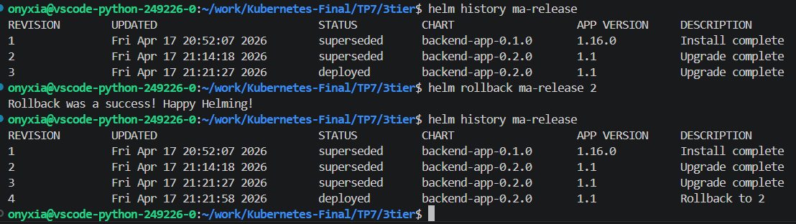

Pour ce tp je suis reparti exactement de la configuration du TP3.

## Exercice 1 

Aucun problème, simplement des copié-collés.

## Exercice 2 

J'ai repris les valeurs de backend.yaml pour les mettre dans values. Je n'ai pas touché les templates à voir si cela pose problème par la suite. 

## Exercice 3

Pas de difficulté les consignes sont claires et j'ai l'impression d'avoir bien compris le fonctionnement général de helm qui il faut le dire fait gagner bien du temps. 
J'avoue que les probes que j'ai gardé dans les values et le template empêche un peu la lisibilité du backend. 

## Exercice 4

Aucun soucis une nouvelle fois. J'ai pû observer que les messages dans le terminal de helm étaient très motivants. Happy Helming ! 

Note : pour ce tp j'ai lancé uniquement le backend et la base postgres. Le reste des deployements, services et pods des tps précédents étaient désactivés. J'ignore donc si l'intégration dans structure globale est parfaite mais théoriquement vu que les valeurs utilisées sont les mêmes il ne devrait pas y avoir de soucis à ce niveau là. 

PS : J'ai refait un dernier commit pcq les fichiers que j'avais supprimé au début sont revenus et les valeurs des fichiers values ont été réinitialisées sans que je m'en rende compte (jsp d'où ça vient). Au moment du nettoyage peut être ? 
